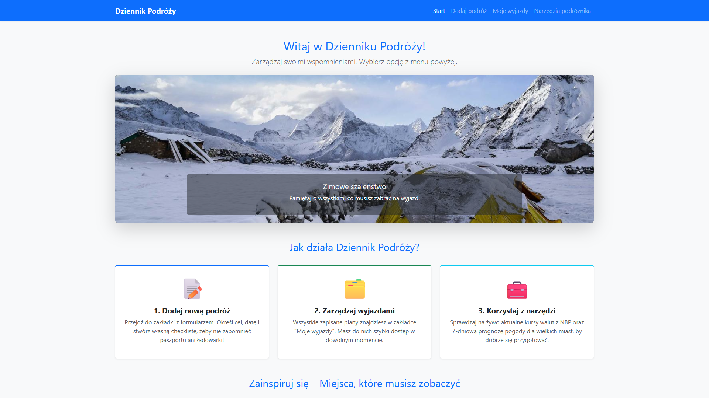

# Dziennik Podróży

Interaktywna aplikacja webowa służąca do planowania wyjazdów, zarządzania listą rzeczy do spakowania oraz zapisywania wspomnień z odbytych tras. Projekt stworzony w celu rozwijania umiejętności budowania nowoczesnych i responsywnych interfejsów użytkownika.

## Podgląd


## Technologie
Projekt został zbudowany w oparciu o następujące technologie:
* **HTML5** – semantyczna struktura aplikacji.
* **CSS3** – niestandardowe style i animacje.
* **JavaScript** – obsługa logiki interfejsu.
* **Bootstrap 5** – framework CSS wykorzystany do stworzenia responsywnej siatki, systemu kart oraz wbudowanych komponentów.

## Funkcjonalności
* **Karuzela wspomnień:** Dynamiczny pokaz slajdów na ekranie startowym prezentujący zapisane podróże.
* **Panel informacyjny:** Przejrzysty układ kroków wyjaśniający działanie dziennika (dodawanie podróży, zarządzanie wyjazdami).
* **Responsywny design:** Interfejs płynnie dopasowujący się do rozdzielczości ekranów urządzeń mobilnych oraz desktopowych.

## Jak uruchomić projekt lokalnie
Projekt nie wymaga konfiguracji skomplikowanego środowiska backendowego ani instalacji zewnętrznych paczek. 

1. Sklonuj repozytorium na swój dysk lokalny:
   ```bash
   git clone [https://github.com/Filip-stack/dziennikPodrozy.git](https://github.com/Filip-stack/dziennikPodrozy.git)
2. Wejdź do folderu z projektem.
3. Otwórz plik index.html w dowolnej nowoczesnej przeglądarce internetowej.
